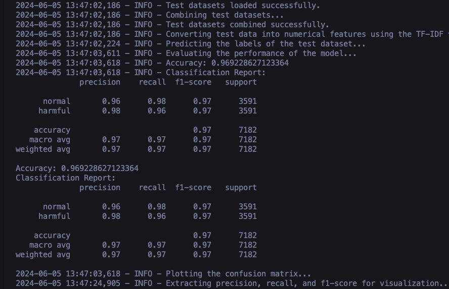
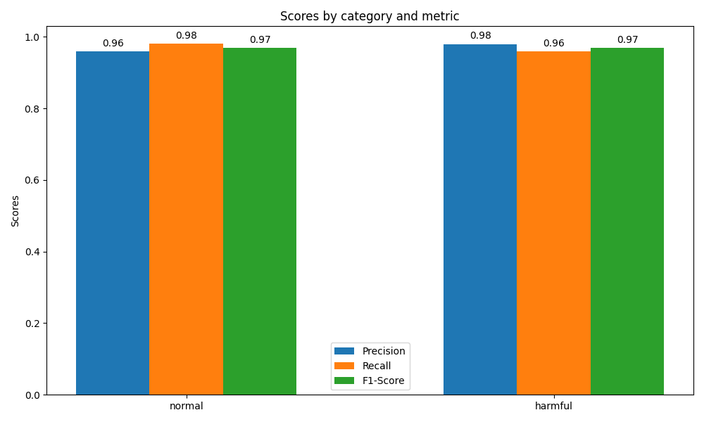
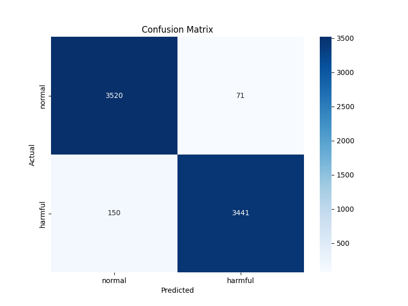

# Tweets SVM Classifier

## Description
This project is an SVM (Support Vector Machine) classifier implemented in Python to categorize tweets. It utilizes machine learning techniques to analyze text and determine the sentiment of tweets as positive, negative, or neutral. This classifier can be particularly effective in social media analytics, marketing analysis, and more due to its robustness and effectiveness in handling high-dimensional data.


## Features
- **Tweet Sentiment Analysis**: Classify tweets into positive or negative (normal or harmful)
- **Data Preprocessing**: Includes scripts for cleaning and preparing tweet data for analysis.
- **Model Training and Evaluation**: Scripts to train the SVM model and evaluate its accuracy.

## How we did it 

1. We began by utilizing a dataset of labeled tweets, with labels assigned as 0 or 1—0 for normal tweets and 1 for harmful tweets.
2. The initial step involved cleaning the dataset by removing unwanted strings such as mentions, hashtags, numbers, emojis, etc. All scripts related to dataset management are available[HERE](manage_dataset/)
3. After cleaning, we segmented the dataset based on labels. For each category, we further divided the data into training and testing sets and balanced these datasets. You can access all scripts for these processes [HERE](manage_dataset/).
4. Once the dataset was prepared, we moved on to the training phase, where we utilized vectorizers and classifiers saved as .pkl models. The trained models can be found [HERE](trained_models/), aalong with the training script [HERE](train.py)
5. We trained the model using 20,000 tweets for each label, amounting to a total of 40,000 tweets.
6. After training, we evaluated the model's performance by measuring its accuracy, precision, recall, and F1 score.
   
## Evaluation Results
 At the end we used 3591 tweets for each label, amounting to a total of 7182 tweets. 

- **Evaluation Report** : The models accuracy is 92.41%, below is a full report of the evaluation where you can find the recision, recall, and f1 score.




- **Precision, Recall, and F1-Score** :
  


- **Confusion Metrix**:
  


## Installation

To set up this project, you will need Python installed on your machine. You can clone this repository and install the required dependencies as follows:

```bash
git clone https://github.com/Jawabreh0/tweets-svm-classifier.git
cd tweets-svm-classifier
python classification.py
```

